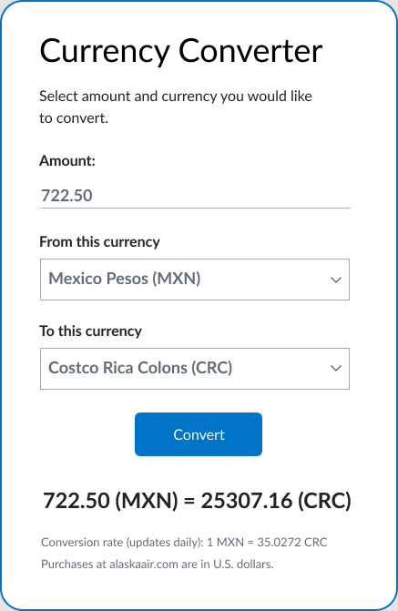

# Currency Converter
Your team has been tasked with building a currency converter to go in the footer of alaskaair.com, it will use the user's geolocation to pre-determine the currency that the converter will convert from. Here's an initial design given to you by the team's designer:


## Currency Converter API
The first part of this task will be to implement a Currency Conversion API that can convert an arbitrary amount of currency from one type to another. You can get the conversion rates in the file `utils/conversionRates.js`.

We should be able to test this by hitting the endpoint: 

`http://localhost:3001/api/currencyConverter?from=[fromCurrencyType]&to=[toCurrencyType]&amount=[amount]`

So for example if we hit, `api/currencyConverter?from=MXN&to=CAD&amount=10` we would expect the response to be the value of 10 Mexico Pesos in Canadian Dollars.

The first part of this is already partially implemented in `server/app.js` using `Express.js`. Feel free to complete the `Express` implementation or use another technology that you prefer. If you choose to use our starter code, **do NOT modify server/server.js, your routes should solely live in server/app.js. This is to ensure the server unit tests run properly.**

## Get Local Currency Type API
The next part will be to implement a Get Local Currency API which uses the user's location and returns the local currency in the user's location. We've researched some ways to approach building this API, feel free to use any of these methods or implement your own:
1. Use the user's IP address and the third-party API [ipapi](https://ipapi.co/api/#specific-location-field).
2. Use the user's IP address and a database such as [IP2Location](https://lite.ip2location.com/ip2location-lite) to retrieve the user's location.
3. Use the built-in [HTML geolocator API](https://www.w3schools.com/html/html5_geolocation.asp) to get the latitude and longitude of a user and then use [Google's reverse geocoding API](https://developers.google.com/maps/documentation/geocoding/overview#ReverseGeocoding) to get the user's location.

We should be able to test this by hitting the endpoint:

```http://localhost:3001/api/locationToCurrency```

So for example, if a user in Mexico hits `api/locationToCurrency`, we should expect the response to be `MXN`.

This is already partially implemented in `server/app.js` using `Express.js`. Feel free to complete the `Express` implementation or use another technology that you prefer.

## API Unit Tests
The next part of this will be to test your APIs to make sure they work as expected.

If you decided to complete the `Express` implementation you can choose to add more tests in `server/app.test.js` which uses `Jest` and `Supertest`. If you used another technology in the previous step, make sure to add unit tests to your API library.

Please add as many tests as you deem necessary.

## Front End
The final part will be to create a front-end that uses the APIs you just created. We have created a `React` app in `client/src/`. Feel free to complete the `React` implementation or use another technology that you prefer.

There are a couple technical requirements that are required for the Front End:
1. It must use the Get Local Currency Type API to get the user's local currency. If it's a currency that we support, it must pre-populate the `fromCurrency` type. If we do not support that currency, then the default is USD.
2. It must use the Currency Converter API to convert the currency.

You can use the design given by the team's designer at the beginning of this README as a reference, but feel free to implement whatever design you like.

We do, however, highly encourage you to use our custom Auro Design System to get any components or colors you may want to use: https://auro.alaskaair.com/getting-started/developers/common-definitions.

## Front End Unit Tests
The next part of your challenge will be to test your front end to make sure it works as expected.

If you decided to complete the `React` implementation you can choose to add more tests in `client/src/App.test.js` which uses `Jest`. If you used another technology in the previous step or prefer not to use `Jest`, make sure to add unit tests in the technology of your choosing.

Please add as many tests as you deem necessary.
## What We're Looking For

- How efficient is the implementation?
- How is the implementation organized?
- How well is the code tested?
- How accessible is the front end?

Please remember to send over your solution at least a couple hours before the start of your interview!

## How to use the starter code
If you decide to use the starter code we've provided, here are a couple useful commands:

### Before developing
- `npm install` - Installs the necessary node modules for your client and server, make sure to do this in the project root
### Running the app
- `npm run dev` - Runs both the client and the server at the same time (might take a minute to run, client should open in a browser automatically)
- `npm run client` - Runs the client
- `npm run server` - Runs the server
### Testing the app
- `npm run test`- Runs all unit tests
- `npm run test-client` - Runs all client tests
- `npm run test-server` - Runs all server tests

Feel free to change the folder structure any way you deem necessary, but be aware it might break the commands described above.

